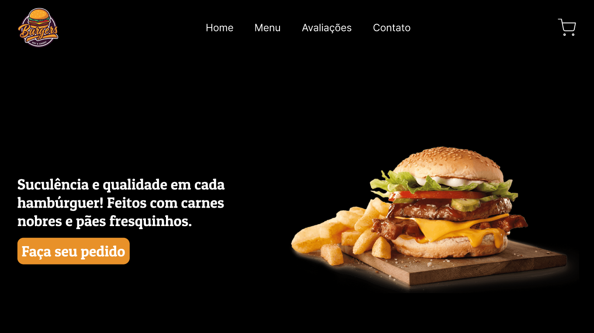
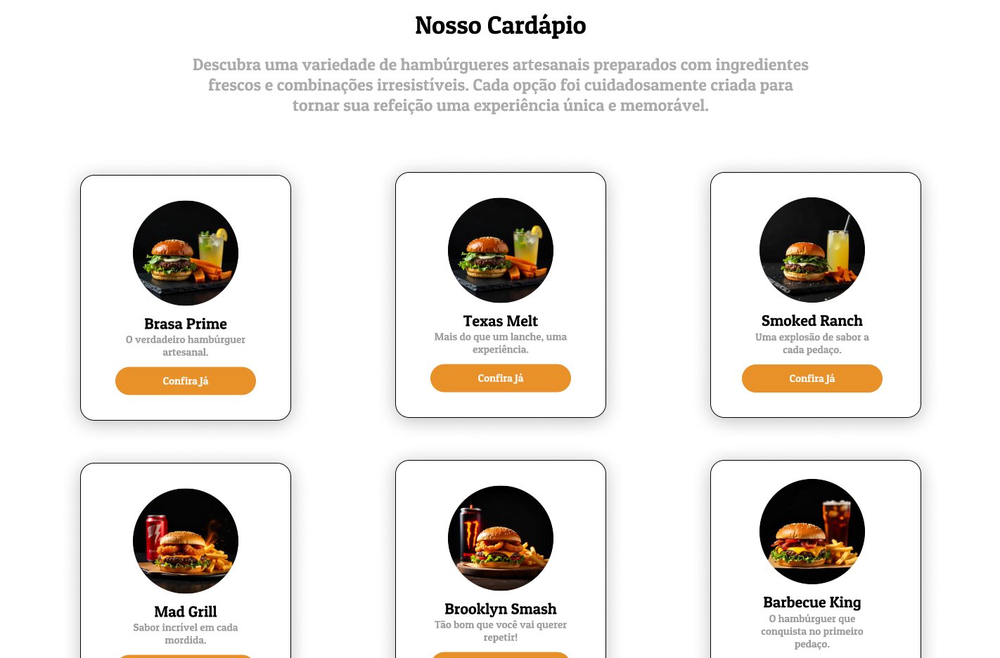
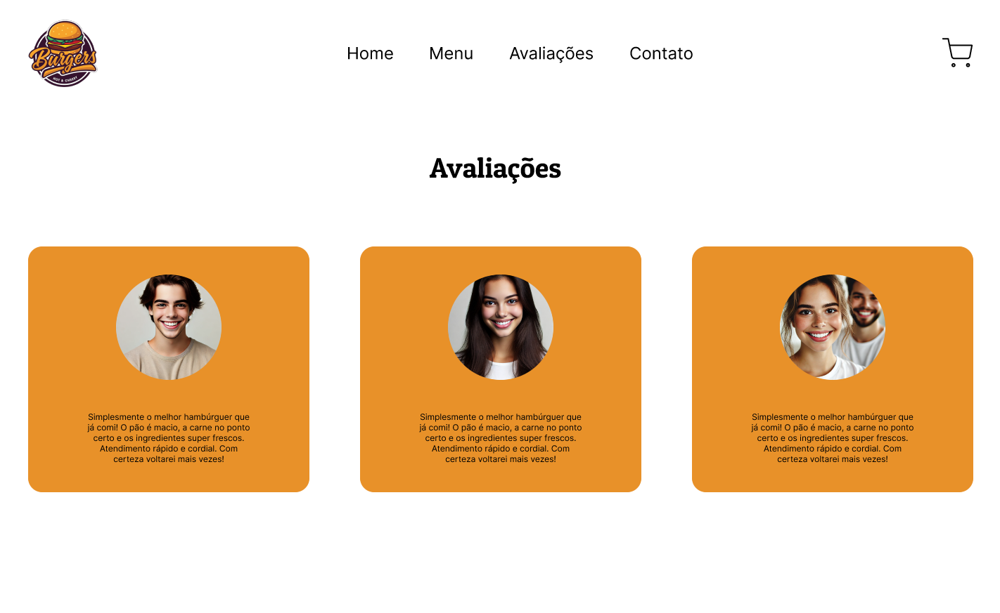
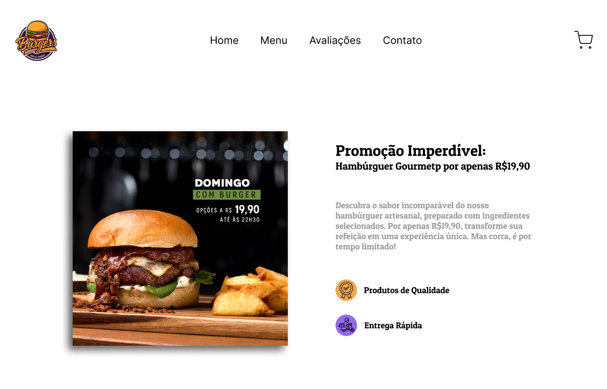
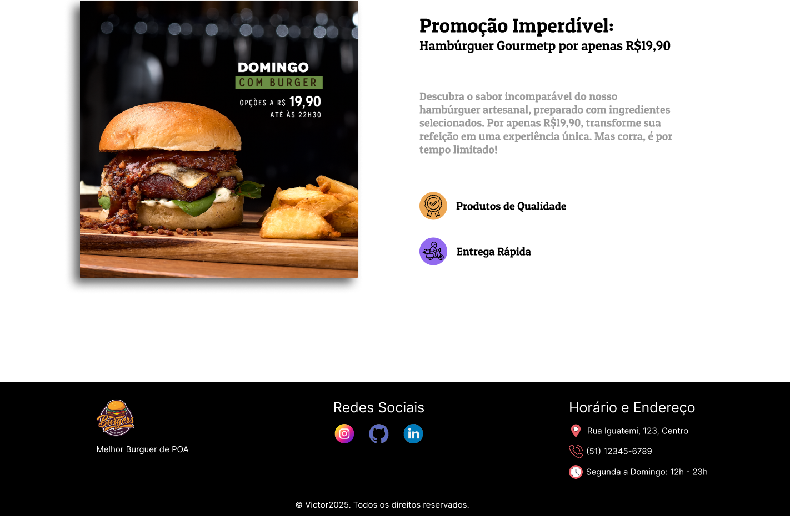
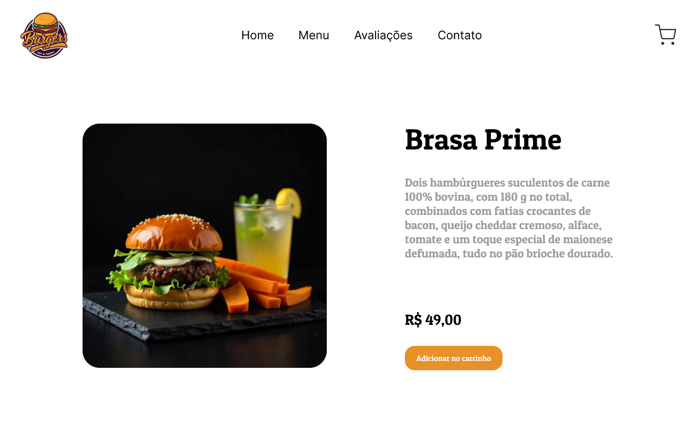
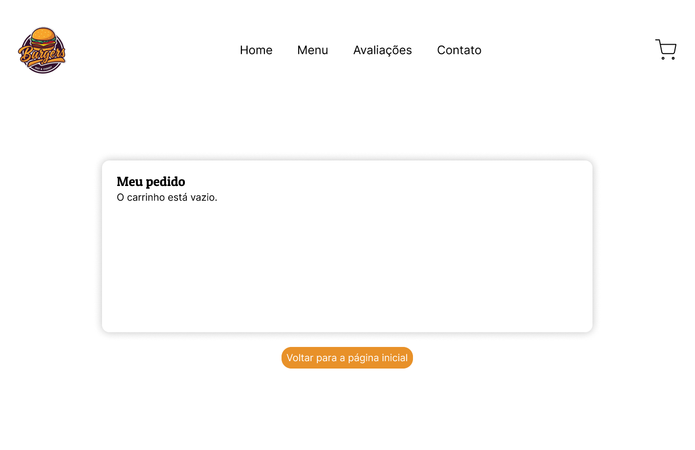
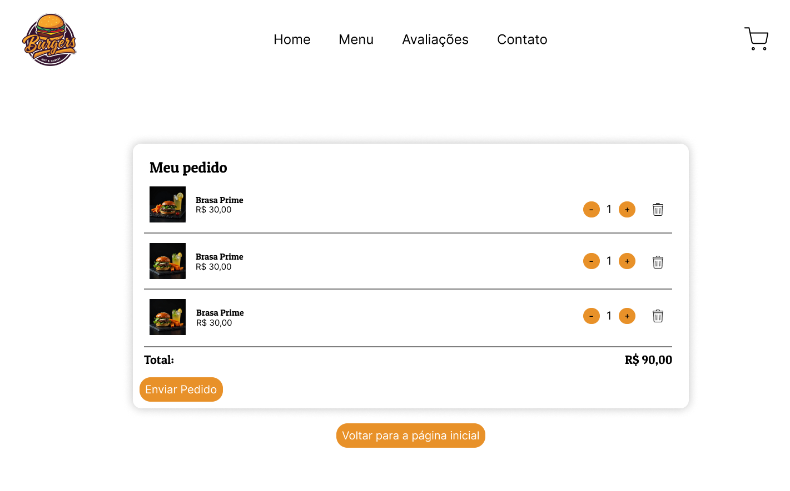

# 🍔 Burguer's - Cardápio Digital

Este é um projeto de um **cardápio digital interativo** para uma hamburgueria fictícia, desenvolvido com **JavaScript** e **ReactJS**. O sistema simula uma aplicação onde o usuário pode navegar pelo cardápio, visualizar produtos, adicionar ao carrinho e realizar pedidos.

## 🔥 Funcionalidades

- Carrossel com destaques na página inicial
- Navegação entre Combos, Acompanhamentos e Bebidas
- Página individual de Produto
- Visualização do Carrinho de compras (vazio e com produtos)
- **Em desenvolvimento**:
  - ✅ Adição de itens ao carrinho  
  - ✅ Remoção de itens do carrinho  
  - ✅ Cálculo automático do valor total da compra

## 👨‍💻 Desenvolvimento

Atualmente, estou implementando a **lógica de gerenciamento do carrinho**, incluindo:
- Função para **adicionar itens** selecionados pelo usuário
- Remoção de produtos diretamente no carrinho
- Cálculo e **exibição da soma total** dos itens adicionados
  
## 🎨 Protótipo no Figma

<table>
  <tr>
    <td align="center"><strong>Home</strong></td>
    <td align="center"><strong>Cardápio</strong></td>
  </tr>
  <tr>
    <td align="center">
      
    </td>
    <td align="center">
      
    </td>
  </tr>

  <tr>
    <td align="center"><strong>Avaliação</strong></td>
    <td align="center"><strong>Promoção</strong></td>
  </tr>
  <tr>
    <td align="center">
      
    </td>
    <td align="center">
      
    </td>
  </tr>

  <tr>
    <td align="center"><strong>Footer</strong></td>
    <td align="center"><strong>Produto</strong></td>
  </tr>
  <tr>
    <td align="center">
      
    </td>
    <td align="center">
      
    </td>
  </tr>

  <tr>
    <td align="center"><strong>Carrinho Vazio</strong></td>
    <td align="center"><strong>Carrinho com Produto</strong></td>
  </tr>
  <tr>
    <td align="center">
      
    </td>
    <td align="center">
      
    </td>
  </tr>
</table>

### 🔗 Link do Projeto no Figma

[Ver projeto completo no Figma](https://www.figma.com/design/157KUGN80DQ6lOaVbFLXzS/Hamburgueria?node-id=0-1&t=fDhPBK3bZ2WrJ0Sx-1)


## 🛠️ Tecnologias Utilizadas

- ReactJS
- JavaScript
- CSS3
- Figma

## 🚀 Como executar o projeto

```bash
# Clone o repositório
git clone https://github.com/seu-usuario/cardapio-react.git

# Acesse a pasta do projeto
cd cardapio-react

# Instale as dependências
npm install

# Execute o projeto
npm start
